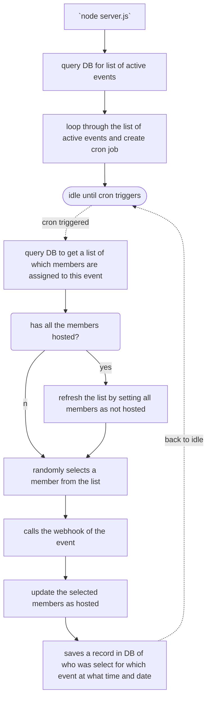

status: prototype

# whosthehost
Tired of finding out who is the host in the rotation for meetings like scrum ceremonies (planning/retrospective/grooming/stand-up) or even team bonding events?

This script will randomly pick a member from a list to host the meeting, it will keep a record of it so it doesn’t pick the same person for more than once in a rotation.
It will send automated reminders via a webhook. 
After everyone have hosted, the list will be reset.

# Current Flow

# Simplified Entity Diagram

### Requirement
- This service will need a webhook to call to tell them who is the host!

### Current Limitations
- Would need to manually restart the service when new event or existing event has the cron expression updated. This is to refresh and start the cronjob.
  - To be updated to use endpoint to trigger refresh

# Phases
## Phase 1 (Big Bang)
_Get the most fundamental features out_
- Manually store list of names in DB via `INSERT` SQL command.
- Set up cron job to trigger at specific time of day
- Query list of names from DB, and randomly pick 1 that has `is_active == true`.
- POST to webhook with the selected host name
- Set the selected host `is_active = true`
- Keep record of who was selected
- Able to cater to multiple rotation list for different webhook that triggers at different timing

## Phase 2 (Zen)
_Ease of use_
- Have simple UI to
  - manage different events
  - manage different members
  - manage which member is in which events
  - view history of who was selected

# Deployment (AWS)
1. Duplicate `.env.dist` and rename to just `.env`, populate the values inside accordingly
2. Deploy an Ubuntu EC2 instance
3. Follow this [guide](https://docs.aws.amazon.com/sdk-for-javascript/v2/developer-guide/setting-up-node-on-ec2-instance.html) to install NodeJS
4. Follow this [guide](https://towardsdatascience.com/running-mysql-databases-on-aws-ec2-a-tutorial-for-beginners-4301faa0c247) to install MySQL
5. Use SFTP to upload your files to your server
6. Install PM2
  - `npm install pm2 -g`
7. Start your service via PM2 to have it running in background
  - `pm2 start index.js`
8. Check your nodejs service
  - `pm2 list`
  - `pm2 log`
